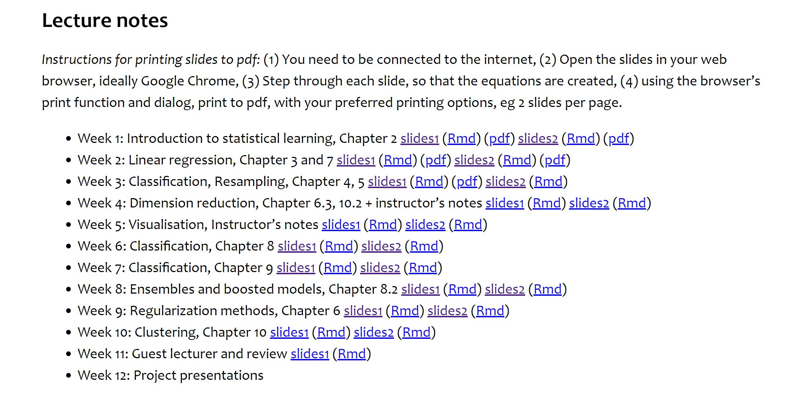

# monba website

* The topics mentioned in the following do not match up with lecture content

* **Week 6** *Classification* Perhaps should be called *tree based methods* since the first lecture is Regression via regression trees.
* **Week 8** *Ensembles and boosted models* should cover RandomForest etc, however covers NN and Regulatisation part 1.
* **Week 9** *Regularization methods* covers Regularisation part 2 and Model assessment. 

Note for the rest of the document - I will use ISLR to refer to *Introduction to Statistical Learning* and ESL to refer to *Elements of Statistical Learning*. 

# Week 1: Introduction to statistical learning

## Introduction

## Introduction 2

* Equations are too small!
* Emphasise inference vs prediction
* pdf file name appears on slides
* I think this lecture should be called *Introduction to Supervised Learning* 

# Week 2: Linear regression

## Regression

* define WHAT regression is. Ie, regression vs classification
* perhaps name 'linear regression'
* regression equation hard to read! (slide 1)
* missing graphics
* `\mbox{}` should be used for words in latex

## Regression 2

* perhaps name 'non-linear regression'

# Week 3: Classification, Resampling

## Classification

* I would at the end compare logistic regression with LDA (especially with assumptions made about each)
* Missing graphics towards the end

## Resampling

* Missing graphics throughout these slides
* `\mbox{}` should be used for text (slide 5)
* describe cross validation in general before LOOCV

# Week 4: Dimension reduction

## Dimension reduction

* PCA needs more explanation (intuitive)
* Equations are small
* A lot of stuff crammed into slides
* Table with PC components is jarring

## Dimension reduction 2

* Elaborate more on PCA vs LDA
* This lecture needs more of a 'goal'

# Week 5: Visualisation

## Visualisation

## Visualisation 2

* Some of the graphics are low resolution

# Week 6: Classification

## Tree-based Models

## Classification trees

# Week 7: Classification

## Random forests

* No definition of *ensemble learning* to begin with - the motivation of why we combine many weak learners might be useful to describe. Why do we use RF etc instead of a single tree? Ans: overfitting
* Remind the student of bias/variance tradeoff. Bagged trees/ RF approach variance component.
* A graphic describing bagging would be useful.
* Slide 4 is too text heavy
* The reason why we don't use all of the predictors is not stated at all. Its the clear distinction between straight bagging and randomforests
* Animated text is distracting
* Should be consistent style for title of slide
* What is the second GGally plotting?
* Boosting is very quickly stated!!
* Why do we boost? Show graphic of the boosting process.
* No R packages for boosting have been shown. `gbm` and `xgboost`.
* Perhaps compare RF and boosting? Most Kaggle competitions have `xgboost` models as the winner - but there is a tradeoff in their use - speed/ number of tuning parameters!

*Notes for me*

* Say that you have very unreliable models, such as Decision Trees. (Why unreliable? Because if you change your data a little bit, the decision tree created can be very different.) In such a case, you can build a robust model (reduce variance) through bagging -- bagging is when you create different models by resampling your data to make the resulting model more robust.
* Both xgboost and gbm follows the principle of gradient boosting. There are however, the difference in modeling details. Specifically, xgboost used a more regularized model formalization to control over-fitting, which gives it better performance.
* C) Weaknesses of the Boosting
GBMs are more sensitive to overfitting if the data is noisy.
Training generally takes longer because of the fact that trees are built sequentially.
GBMs are harder to tune than RF. There are typically three parameters: number of trees, depth of trees and learning rate, and each tree built is generally shallow.
* Boosting reduces variance, and also reduces bias. It reduces variance because you are using multiple models (bagging). It reduces bias by training the subsequent model by telling them what errors the previous models made (the boosting part).

## Support vector machines

# Week 8: Ensembles and boosted models

## Neural networks

 * I note that NN are not covered in ISLR. Perhaps reference to ESL Chapter 11 would be useful, especially "11.5 Some Issues in Training Neural Networks".
 * A motivation to *why* NN are useful is not provided. Perhaps elaborating on the image processing example at the end as a motivator might be more useful! Link to 3Blue1Brown NN video. I think a NN trained on MINST data might be a better motivator than the chocolate example.
 * On the same note, issues with NN are not discussed either.
 * Perhaps mention other NN packages for R? `keras` `tensorflow` etc
 * Link Linear/Logistic regression to NN (See Galit's video below)
 
 
 **Advantages**
 
 * Capture highly complex relationships
 * Works well when there are lots of training samples available.
 
 **Disadvantages**
 
 * Interpretability - prediction vs inference. NN are seen as a black box type of model.
 * Requires ine tuning and prone to overfitting - the model is generally overparameterised to begin with.
 * Computationally intensive. Many NN applications are now built upon GPUs rather than CPUs.
 
 
 **Extra Resources**
 
 * Galit Shmueli [YouTube Videos](https://www.youtube.com/watch?v=3N4M7jmPD9Q)
 * 3Blue1Brown [YouTube Videos](https://www.youtube.com/watch?v=aircAruvnKk&t=258s)
 
## Regularization

* I would move this to straight after logistic regression / linear regression.

 
# Week 9: Regularization methods

## Regularization 2

## Model assessment

# Week 10: Clustering

## k-means clustering

## hierarchical clustering

# Week 11: Guest lecturer and review 

 