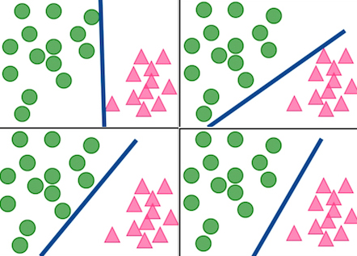
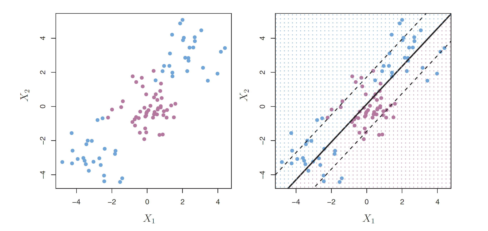

```{r setup, include=FALSE}
library(knitr)
knitr::opts_chunk$set(tidy = FALSE, 
                      message = FALSE,
                      warning = FALSE,
                      echo = FALSE, 
                      fig.width=8,
                      fig.height=6,
                      fig.align = "center",
                      fig.retina = 4)
options(htmltools.dir.version = FALSE)
library(magick)
```

## Seperating hyperplanes

In a $p$-dimensional space, a .orange[hyperplane] is a flat affine subspace of dimension $p - 1$.

<center>

</center>

.font-65[(ISLR: Fig 9.1)]
---
## Separating hyperplanes 

The equation of $p$-dimensional hyperplane is given by

$$\beta_0 + \beta_1 X_1 + \dots + \beta_p X_p = 0$$


If $x_i \in \Re^p$ and $y_i \in \{-1, 1\}$ for $i = 1, \dots, n$, then

$$\beta_0 + \beta_1 x_{i1} + \dots + \beta_p x_{ip} > 0 \mbox{ if }  y_i = 1,$$ 
	
$$\beta_0 + \beta_1 x_{i1} + \dots + \beta_p x_{ip} < 0 \mbox{ if } y_i = -1$$


Equivalently,

$$y_i (\beta_0 + \beta_1 x_{i1} + \dots + \beta_p x_{ip}) > 0$$


---
## Separating hyperplanes


- A new observation is assigned a class depending on .orange[which side] of the hyperplane it is located
- Classify the test observation $x^*$ based on the .orange[sign] of 
$$s(x^*) = \beta_0 + \beta_1 x_1^* + \dots + \beta_p x_p^*$$
- If $s(x^*) > 0$, class $1$, and if $s(x^*) < 0$, class $-1$, i.e. $h(x^*) = \mbox{sign}(s(x^*)).$


What about the .orange[magnitude] of $s(x^*)$? 

- $s(x^*) \mbox{ far from zero } \rightarrow$ $x^*$ lies far from the hyperplane + **more confident** about our classification
- $s(x^*) \mbox{ close to zero } \rightarrow$ $x^*$ near the hyperplane + **less confident** about our classification

---


## From LDA to SVM

- Linear discriminant analysis uses the difference between means to set the separating hyperplane.
- Support vector machines uses .orange[gaps] between points on the outer edge of clusters to set the separating hyperplane.

```{r out.width="70%", fig.width=6, fig.height=3}
library(tidyverse)
library(MASS)
library(e1071)
library(gridExtra)
olive <- read_csv("data/olive.csv") %>%
  rename(name=X1) %>%
  mutate(region = factor(region, levels=1:3, labels=c("south", "sardinia", "north")))
olive_p <- as_tibble(expand.grid(eicosenoic = seq(0, 60, 1), linoleic = seq(440, 1500, 10))) 

olive_lda <- lda(region~eicosenoic+linoleic, data=olive, 
                 prior=c(1/3, 1/3, 1/3))
olive_p$region <- predict(olive_lda, olive_p)$class
p1 <- ggplot() +
  geom_point(data=olive_p, aes(x=eicosenoic, y=linoleic, color=region), alpha=0.1) +
  geom_point(data=olive, aes(x=eicosenoic, y=linoleic, color=region, shape=region)) +
  scale_color_brewer("", palette="Dark2") +
  theme_bw() + theme(aspect.ratio=1, legend.position="none") +
  ggtitle("LDA")

olive_svm <- svm(region~eicosenoic+linoleic, data=olive, kernel="linear")
olive_p$region <- predict(olive_svm, olive_p)
p2 <- ggplot() + 
  geom_point(data=olive_p, aes(x=eicosenoic, y=linoleic, color=region), alpha=0.1) +
  geom_point(data=olive, aes(x=eicosenoic, y=linoleic, color=region, shape=region)) + 
  scale_color_brewer("", palette="Dark2") +
  theme_bw() + theme(aspect.ratio=1, legend.position="none") +
  ggtitle("SVM")
grid.arrange(p1, p2, ncol=2)
```


---
## Maximal margin classifier


All are separating hyperplanes. .orange[Which is best?]

<center>

</center>


---
## Maximal margin classifier


<center>

</center>
---
## SVM vs Logistic Regression

- If our data can be perfectly separated using a hyperplane, then there will in fact exist an **infinite number of such hyperplanes**.
- We compute the (perpendicular) distance from each training observation to a given separating hyperplane. The .orange[smallest] such distance is known as the .orange[margin].
- The .orange[optimal separating hyperplane] (or maximal margin hyperplane)  is the separating hyperplane for which the margin is .orange[largest]. 
- We can then classify a test observation based on which side of the maximal margin hyperplane it lies. This is known as the .orange[maximal margin classifier].


---
## Support vectors


---
## Support vectors

- The .orange[support vectors] are equidistant from the maximal margin hyperplane and lie along the dashed lines indicating the width of the margin. 
- They .orange[support] the maximal margin hyperplane in the sense that if these points were moved slightly then the maximal margin hyperplane would move as well
- The maximal margin hyperplane depends directly on the support vectors, but .orange[not on the other observations]


---

### Example: Support vectors (and slack vectors)

```{r out.width="100%", fig.height=3, fig.width=6, align="center"}
indx <- olive_svm$index[abs(olive_svm$coefs[,1])<1 & abs(olive_svm$coefs[,2])<1]
svs <- olive[indx,]
p1 <- ggplot() +
  geom_point(data=olive_p, aes(x=eicosenoic, y=linoleic, color=region), alpha=0.01) +
  geom_point(data=olive, aes(x=eicosenoic, y=linoleic, color=region, shape=region)) + 
  geom_point(data=svs, aes(x=eicosenoic, y=linoleic), color="black", shape=1, size=3) +
  scale_color_brewer("", palette="Dark2") +
  theme_bw() + theme(aspect.ratio=1, legend.position="none")
svs <- olive[olive_svm$index,]
p2 <- ggplot() +
  geom_point(data=olive_p, aes(x=eicosenoic, y=linoleic, color=region), alpha=0.01) +
  geom_point(data=olive, aes(x=eicosenoic, y=linoleic, color=region, shape=region)) + 
  geom_point(data=svs, aes(x=eicosenoic, y=linoleic), color="black", shape=1, size=3) +
  scale_color_brewer("", palette="Dark2") +
  theme_bw() + theme(aspect.ratio=1, legend.position="none")
grid.arrange(p1, p2, ncol=2)
```

---
## Maximal margin classifier


If $x_i \in \Re^p$ and $y_i \in \{-1, 1\}$ for $i = 1, \dots, n$, the separating hyperplane is defined as

$$\{x:b_0+x'b=0\}$$

where $b=\sum_{i=1}^s (\alpha_iy_i)x_i$ and $s$ is the number of support vectors.
Then the .orange[maximal margin hyperplane] is found by 

*maximising* $M$, subject to $\sum_{i=1}^pb_i^2=1$, and $y_i(x_i'b+b_0)\geq M, i=1, ..., n$.


---
class: split-60
layout: false

.column[.pad50px[

## Non-seperable case

The maximal margin classifier only works when we have perfect seperability in our data.

.green[What do we do if data is not perfectly seperable by a hyperplane?]

 .orange[**The Soft Margin Classifier**] allows points to either lie on the wrong side of the margin, or on the wrong side of the hyperplane altogether. 
 
 .font_tiny[Right: ISLR Fig 9.6]
]]

.column[.content.vmiddle.center[


 </a>

]]

---
## Soft margin classifier - optimisation 

<br>

*Maximise* $M$, subject to $\sum_{i=1}^pb_i^2=1$, and $y_i(x_i'b+b_0)\geq M(1-\epsilon_i), i=1, ..., n$, AND $\epsilon_i\geq 0, \sum_{i=1}^n\epsilon_i\leq C$.

$\varepsilon_i$ tells us where the $i$th observation is located and $C$ is a nonnegative .orange[tuning parameter].

- $\varepsilon_i = 0$: correct side of the margin,
- $\varepsilon_i > 0$: wrong side of the margin (violation of the margin),
- $\varepsilon_i > 1$: wrong side of the hyperplane.


---
## Non-seperable case

.orange[Tuning parameter]: decreasing the value of *C*

```{r}
if (!file.exists("images/9.7.png"))
  image_write(image_read("http://www-bcf.usc.edu/~gareth/ISL/Chapter9/9.7.pdf", density = 300), "images/9.7.png", 
      format = "png", density = 300)
```

<center>
<a href="http://www-bcf.usc.edu/~gareth/ISL/Chapter9/9.7.pdf" target="_BLANK">  </a>
</center>

---

## Non-linear boundaries

The soft margin classifier doesn't work well for non-linear boundaries. .green[What solution do we have?]

<center>

</center>


---
class: split-60
layout: false

.column[.pad50px[
## Support Vector Machines


.orange[The kernel trick]

Because $b=\sum_{i=1}^s (\alpha_iy_i)x_i$  $y_i(x_i'b+b_o)$ can be written as

 $$y_i(\alpha_i x_i'x_i+b_o)$$ 

and $x_i'x_i$ can be wrapped into a kernel function $K(x_i'x_i)$ which enables building nonlinear boundaries.

]]

.column[.content.vmiddle.center[


]]


---
## Non-linear boundaries
.orange[Polynomial] and .orange[radial] kernel SVMs

```{r}
if (!file.exists("images/9.9.png"))
  image_write(image_read("http://www-bcf.usc.edu/~gareth/ISL/Chapter9/9.9.pdf", density = 300), "images/9.9.png", 
      format = "png", density = 300)
```

<a href="http://www-bcf.usc.edu/~gareth/ISL/Chapter9/9.9.pdf" target="_BLANK">  </a>
---
## Non-linear boundaries

Italian olive oils: Regions 2, 3 (North and Sardinia)

```{r out.width="70%"}
olive_sub <- olive %>% filter(region != "south")

olive_svm <- svm(region~linoleic + arachidic, data=olive_sub, kernel="polynomial", degree=2)
olive_p <- data.frame(expand.grid(linoleic = seq(440, 1500, 10), arachidic = seq(0, 105, 2)))
olive_p$region <- predict(olive_svm, olive_p)

p1 <- ggplot() + 
  geom_point(data=olive_p, aes(x=linoleic, y=arachidic, color=region), alpha=0.1) +
  geom_point(data=olive_sub, aes(x=linoleic, y=arachidic, color=region, shape=region), alpha=0.5) +
  scale_color_brewer("", palette="Dark2") + 
  theme_bw() + theme(aspect.ratio=1, legend.position="none") + 
  ggtitle("Polynomial kernel")

olive_svm <- svm(region~linoleic + arachidic, data=olive_sub, 
  kernel="radial")
olive_p$region <- predict(olive_svm, olive_p)
p2 <- ggplot() + 
  geom_point(data=olive_p, aes(x=linoleic, y=arachidic, color=region), alpha=0.1) +
  geom_point(data=olive_sub, aes(x=linoleic, y=arachidic, color=region, shape=region), alpha=0.5) +
  scale_color_brewer("", palette="Dark2") + 
  theme_bw() + theme(aspect.ratio=1, legend.position="none") + 
  ggtitle("Radial kernel")
grid.arrange(p1, p2, ncol=2)

```


---
## SVM in high dimensions

Examining misclassifications and which points are selected to be support vectors

<center>

<video width="700" controls> <source src="http://www.ggobi.org/book/chap-class/SVM.mov"> </video>

</center>
```{r eval=FALSE}
# Independent code block, so all is here
library(tidyverse)
library(e1071)
library(tourr)
library(RColorBrewer)
olive <- read_csv("data/olive.csv") %>%
  rename(name=X1) %>%
  mutate(region = factor(region, levels=1:3, labels=c("south", "sardinia", "north")))
olive_sub <- olive %>% filter(region == "sardinia") %>%
  mutate(area=factor(area))

olive_svm <- svm(area~., data=olive_sub[,-c(1,2)], kernel="linear")
pch <- rep(1, nrow(olive_sub))
pch[olive_svm$index] <- 16
pal <- brewer.pal(3, "Dark2")
col <- pal[as.numeric(olive_sub$area)]
quartz()
animate_xy(olive_sub[,4:10], axes="bottomleft", col=col, pch=pch) 
```


---
## SVM in high dimensions

[Examining boundaries](http://www.ggobi.org/book/chap-class/classifly.mov)

<video width="700" controls> <source src="http://www.ggobi.org/book/chap-class/classifly.mov"> </video>


---
## SVM in high dimensions

[Boundaries of a radial kernel in 3D](https://vimeo.com/125405961)

<video width="700" controls> <source src="https://vimeo.com/125405961"> </video>


---
## SVM in high dimensions

[Boundaries of a polynomial kernel in 5D](https://vimeo.com/125405962)

<video width="700" controls> <source src="https://vimeo.com/125405962"> </video>


---
class: center 

## Comparing decision boundaries

```{r out.width="100%", fig.width=6, fig.height=3}
library(tidyverse)
library(MASS)
library(e1071)
library(gridExtra)
library(randomForest)
library(mlbench)

# Generate the data
set.seed(1)
spirals <-mlbench.spirals(300,1.5,0.05)
data <- as.data.frame(cbind(spirals$x, spirals$classes))
colnames(data) <-  c("X1", "X2", "class")
data$class <- as.factor(data$class)
data_p <- as.data.frame(expand.grid(X1 = seq(-1.5,1.5,0.05), X2 = seq(-1.5,1.5,0.05)))

# Generate RF plot

data_RF <- randomForest(class ~ X1 + X2, data = data)
data_p$region_RF <- predict(data_RF, data_p)

p1 <- ggplot() +
  geom_point(data = data_p, aes(x = X1, y = X2, color = region_RF), alpha = 0.1) +
  geom_point(data = data, aes(x = X1, y = X2, color = class, shape = class), size = 1) +
  geom_contour(data = data_p, aes(x= X1, y=X2, z= as.numeric(region_RF)), breaks=c(1.5), color="black", size=0.8) +
  scale_color_brewer("", palette="Dark2") +
  theme_minimal() + theme(aspect.ratio=1, legend.position="none") +
  ggtitle("Random Forest")

# Generate SVM plot 


data_SVM <- svm(class ~ X1 + X2, data = data, kernel = "radial", cost = 10)
data_p$region_SVM <- predict(data_SVM, data_p)

p2 <- ggplot() +
  geom_point(data = data_p, aes(x = X1, y = X2, color = region_SVM), alpha = 0.1) +
  geom_point(data = data, aes(x = X1, y = X2, color = class, shape = class), size = 1) +
  geom_contour(data = data_p,  aes(x= X1, y=X2, z= as.numeric(region_SVM)), breaks=c(1.5), color="black", size=0.8) +
  scale_color_brewer("", palette="Dark2") +
  theme_minimal() + theme(aspect.ratio=1, legend.position="none") +
  ggtitle("SVM")


data_lda <- lda(class ~ X1 + X2, data = data)
data_p$region_lda <- predict(data_lda, data_p)$class

p3 <- ggplot() +
  geom_point(data = data_p, aes(x = X1, y = X2, color = region_lda), alpha = 0.1) +
  geom_point(data = data, aes(x = X1, y = X2, color = class, shape = class), size = 1) +
  geom_contour(data = data_p,  aes(x= X1, y=X2, z= as.numeric(region_lda)), breaks=c(1.5), color="black", size=0.8) +
  scale_color_brewer("", palette="Dark2") +
  theme_minimal() + theme(aspect.ratio=1, legend.position="none") +
  ggtitle("LDA")


grid.arrange(p1, p2, p3, ncol=3)
```
---
## Increasing the value of `cost` in `svm`

```{r out.width="80%"}
library(tidyverse)
library(MASS)
library(e1071)
library(gridExtra)
library(randomForest)
library(mlbench)

# Generate the data

set.seed(1)

spirals <-mlbench.spirals(300,1.5,0.05)
data <- as.data.frame(cbind(spirals$x, spirals$classes))
colnames(data) <-  c("X1", "X2", "class")
data$class <- as.factor(data$class)
data_p <- as.data.frame(expand.grid(X1 = seq(-1.5,1.5,0.05), X2 = seq(-1.5,1.5,0.05)))

# Generate Models

data_SVM <- svm(class ~ X1 + X2, data = data, kernel = "radial", cost = 1)
data_p$region_1 <- predict(data_SVM, data_p)
data_SVM <- svm(class ~ X1 + X2, data = data, kernel = "radial", cost = 2)
data_p$region_2 <- predict(data_SVM, data_p)
data_SVM <- svm(class ~ X1 + X2, data = data, kernel = "radial", cost = 5)
data_p$region_5 <- predict(data_SVM, data_p)
data_SVM <- svm(class ~ X1 + X2, data = data, kernel = "radial", cost = 10)
data_p$region_10 <- predict(data_SVM, data_p)

# Cost 1
g1 <- ggplot() +
  geom_point(data = data_p, aes(x = X1, y = X2, color = region_1), alpha = 0.1) +
  geom_point(data = data, aes(x = X1, y = X2, color = class, shape = class), size = 1) +
  geom_contour(data = data_p, aes(x= X1, y=X2, z= as.numeric(region_1)), breaks=c(1.5), color="black", size=0.8) +
  scale_color_brewer("", palette="Dark2") +
  theme_minimal() + theme(aspect.ratio=1, legend.position="none") +
  ggtitle("Cost = 1")

# Cost = 2

g2 <- ggplot() +
  geom_point(data = data_p, aes(x = X1, y = X2, color = region_2), alpha = 0.1) +
  geom_point(data = data, aes(x = X1, y = X2, color = class, shape = class), size = 1) +
  geom_contour(data = data_p,  aes(x= X1, y=X2, z= as.numeric(region_2)), breaks=c(1.5), color="black", size=0.8) +
  scale_color_brewer("", palette="Dark2") +
  theme_minimal() + theme(aspect.ratio=1, legend.position="none") +
  ggtitle("Cost = 2")

# Cost = 5

g3 <- ggplot() +
  geom_point(data = data_p, aes(x = X1, y = X2, color = region_5), alpha = 0.1) +
  geom_point(data = data, aes(x = X1, y = X2, color = class, shape = class), size = 1) +
  geom_contour(data = data_p,  aes(x= X1, y=X2, z= as.numeric(region_5)), breaks=c(1.5), color="black", size=0.8) +
  scale_color_brewer("", palette="Dark2") +
  theme_minimal() + theme(aspect.ratio=1, legend.position="none") +
  ggtitle("Cost = 5")

# Cost = 10

g4 <- ggplot() +
  geom_point(data = data_p, aes(x = X1, y = X2, color = region_10), alpha = 0.1) +
  geom_point(data = data, aes(x = X1, y = X2, color = class, shape = class), size = 1) +
  geom_contour(data = data_p,  aes(x= X1, y=X2, z= as.numeric(region_10)), breaks=c(1.5), color="black", size=0.8) +
  scale_color_brewer("", palette="Dark2") +
  theme_minimal() + theme(aspect.ratio=1, legend.position="none") +
  ggtitle("Cost = 10 ")


library(gtable)
library(grid)
pl <- lapply(list(g1,g2,g3,g4), ggplotGrob)
g12 <- cbind(pl[[1]], pl[[2]], size="first")
g12$heights <- unit.pmax(pl[[1]][["heights"]], pl[[2]][["heights"]])
g34 <- cbind(pl[[3]], pl[[4]], size="first")
g34$heights <- unit.pmax(pl[[3]][["heights"]], pl[[4]][["heights"]])
g1234 <- rbind(g12, g34, size="first")
g1234$widths <- unit.pmax(g12[["widths"]], g34[["widths"]])
grid.newpage()
grid.draw(g1234)
```


---
layout: false
# `r set.seed(2019); emo::ji("technologist")` Made by a human with a computer

### Slides at [https://monba.dicook.org](https://monba.dicook.org).
### Code and data at [https://github.com/dicook/Business_Analytics](https://github.com/dicook/Business_Analytics).
<br>

### Created using [R Markdown](https://rmarkdown.rstudio.com) with flair by [**xaringan**](https://github.com/yihui/xaringan), and [**kunoichi** (female ninja) style](https://github.com/emitanaka/ninja-theme).

<br> 
<a rel="license" href="http://creativecommons.org/licenses/by-sa/4.0/"></a><br />This work is licensed under a <a rel="license" href="http://creativecommons.org/licenses/by-sa/4.0/">Creative Commons Attribution-ShareAlike 4.0 International License</a>.
