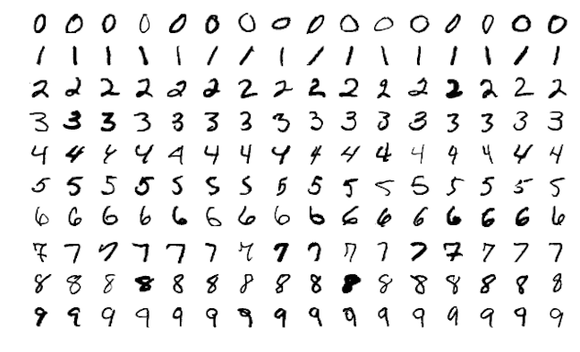
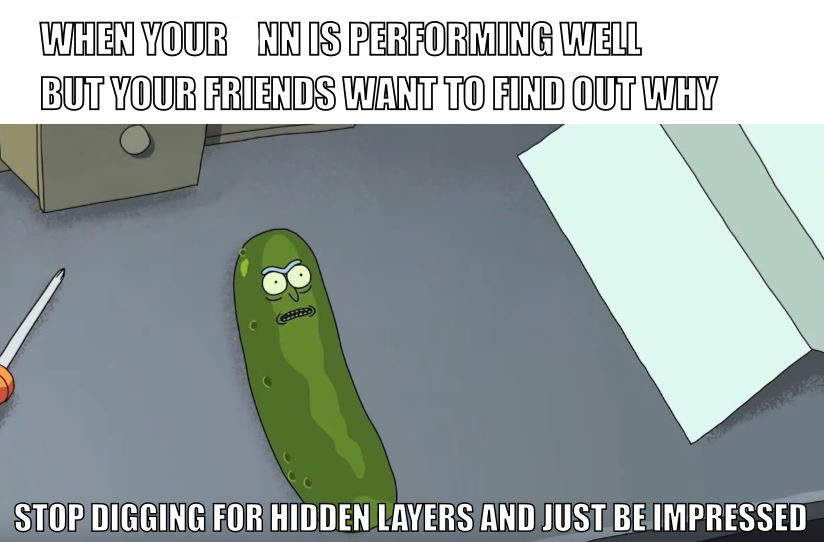

```{r setup, include=FALSE}
library(knitr)
knitr::opts_chunk$set(tidy = FALSE, 
                      message = FALSE,
                      warning = FALSE,
                      echo = FALSE, 
                      fig.width=8,
                      fig.height=6,
                      fig.align = "center",
                      fig.retina = 4)
options(htmltools.dir.version = FALSE)
library(magick)
```

class: split-two

.column[.pad50px[

## What number is this?

<br>

This is a three, right?

]]

.column[.content.vmiddle.center[


]]


---
class: split-two

.column[.pad50px[

## What number is this?

<br>

Is this also a three?

]]

.column[.content.vmiddle.center[


]]

---

class: split-two

.column[.pad50px[

## What number is this?

<br>

But what about this number? Not a three?

]]

.column[.content.vmiddle.center[


]]
---
## The human brain

The human brain can efficiently recognise that although the images of the two threes are different, they are the same number, and are both distinct from the five.

<center>

</center>
---

class: split-two

.column[.pad50px[

## MNIST data
<br>
The .green[MNIST data] was presented to AT&T Bell Lab's to build automatic mail sorting machines.

.orange[Goal:] Analyse handwriteen digits and predict numbers written, given a $28 \times 28$ grid of pixels for each of the  60000 training images. Digits range from 0-9. 

]]


.column[.content.vmiddle.center[





]]

---
class: split-two

.column[.pad50px[

## MNIST data

.green[How do we do this?]

Humans are good at detecting different features about the images, such as thickness of line, angles, edges, completeness of circles, etc.

It is evident a complex relationship is presented in the images. .orange[Neural networks] can help us automatically capture these complexities.

]]

.column[.content.vmiddle.center[


]]
---

class: split-two

.column[.pad50px[

## So, what are neural networks?

**Idea:** .green[Capture a complex relationship between outputs and inputs by creating layers of derived variables.]

$y$ = output variable

$x$ = original input variable

$f(x)$ = derived variable input

]]

.column[.content.vmiddle.center[

$$ y = f_1(f_2(\dots (f_d(x))))$$

<br>


]]


---

## How do we build a neural network?

To build a feedforward neural network, we need .orange[four key components:]

1. Input data (*in this case, the MNIST data*)
2. A pre-defined network architecture;
3. A feedback mechanism to enable the network to learn; 
4. and a model training approch.


---

## The data - preprocrssing

Add warning sign for data to be one hot encoded (dummy variables)

```{r}
library(dplyr) 
library(keras)

# Import MNIST training data
mnist <- dslabs::read_mnist()
mnist_x <- mnist$train$images
mnist_y <- mnist$train$labels

# Rename columns and standardize feature values
colnames(mnist_x) <- paste0("V", 1:ncol(mnist_x))
mnist_x <- mnist_x / 255

# One-hot encode response
mnist_y <- to_categorical(mnist_y, 10)
```
---

## Network architecture

When building architecture for the neural network, we are concerned about two key features: 

- The number of layers and nodes, and
- How signal is activated through the network 

---

## Layers and nodes

- Input and output layers
- Hidden layers


In R, we use the `keras` package to help us build neural networks with a layered approach. It is very different to other machine learning types we have encountered in this course.


---

## Hidden layers

- No well-defined approach for selecting the number of hidden layers - this is just one of many hyperparameters we will need to tune! .orange[2-5 laters works well most of the time for regular tabular data].
- The more hidden layers - the longer the model will take to train (as we are adding more parameters!)

[insert picture higlighting hidden layers]


---

## Output layers

- Choice of output later is determined by the ML task. If you are doing regression - a single node.
- Classification - a node for each class if multiclass.
- If binary, single node for probability of predicting success.

Think? How many nodes will MNIST data NN contain?
---

## Building network structure in R

We use the keras package. Initiate an architecture.

```{r, eval = FALSE, echo = TRUE}
library(keras)
model <- keras_model_sequential() %>%
  layer_dense(units = 16,
              input_shape = ncol(mnist_x)) %>%
  layer_dense(units = 16) %>%
  layer_dense(units = 10)
```


---

## Activation - how do the layers speak?

---
class: split-30
layout: false

.column[.pad10px[
## Outline

- .orange[Logistic regression]


]]
.column[.top50px[

Remember the logistic function:

\begin{align}
y &=& \frac{e^{\beta_0+\sum_{j=1}^p\beta_jx_j}}{1+e^{\beta_0+\sum_{j=1}^p\beta_jx_j}}\\
  &=& \frac{1}{1+e^{-(\beta_0+\sum_{j=1}^p\beta_jx_j)}}
\end{align}

Alternatively,

$$\log_e\frac{y}{1 - y} = \beta_0+\sum_{j=1}^p\beta_jx_j$$
]]

---
class: split-50
layout: false

.column[.top50px[

What the .orange[logistic function] looks like:

\begin{align}
y =\frac{1}{1+e^{-(\beta_0+\sum_{j=1}^p\beta_jx_j})}
\end{align}

]]

.column[.top50px[


```{r out.width="80%", fig.width=4, fig.height=4}
library(tidyverse)
x <- seq(-2, 2, 0.1)
y <- exp(1+3*x)/(1+exp(1+3*x))
df2 <- tibble(x, y)
ggplot(df2, aes(x=x, y=y)) + 
  geom_line() +
  geom_hline(yintercept=0.5, colour="orange") +
  annotate("text", x=0.75, y=0.6, label="Activation threshold", colour="orange") +
  geom_hline(yintercept=c(0,1), linetype=2)
```


]]
---
class: middle

```{r out.width="100%"}
library(memer)
meme_get("ThinkAboutIt")
```

<center>
.font_large[Hang on to this idea....]
</center>
---
class: split-30
layout: false

.column[.pad10px[
## Outline

- [Logistic regression](#2)
- .orange[Network explanation]
    - Linear regression as a network

]]
.column[.top50px[

.split-50[

.column[
$$\hat{y} =\beta_0+\sum_{j=1}^p\beta_jx_j$$

Drawing as a network model: 


]
.column[

<br>
<br>
<br>
<br>
<br>
<br>
$p$ .orange[inputs] (predictors), multiplied by .orange[weights] (coefficients), summed, add a .orange[constant], predicts .orange[output] (response)
]
]
]]

---
class: split-30
layout: false

.column[.pad10px[
## Outline

- [Logistic regression](#2)
- .orange[Network explanation]
    - Linear regression as a network
    - Hidden layer

]]
.column[.top50px[

$$\hat{y} =\alpha_{0}+\sum_{k=1}^s(\alpha_{k}(\beta_{j0}+\sum_{j=1}^p\beta_{jk}x_j))$$

A linear regression model nested within a linear regression model allows for intrinsic dimension reduction, or expansion.


]]

---
class: split-30
layout: false

.column[.pad10px[
## Outline

- [Logistic regression](#2)
- [Network explanation](#4)
- .orange[Neural network model]
    - Two layer perceptron

]]
.column[.top50px[

This is a single output, 2 layer, perceptron (neural network), with a linear threshold.

\begin{align}
\hat{y} =\alpha_{0}+\sum_{k=1}^s(\alpha_{k}(\beta_{j0}+\sum_{j=1}^p\beta_{jk}x_j))
\end{align}


]]

---
class: split-30
layout: false

.column[.pad10px[
## Outline

- [Logistic regression](#2)
- [Network explanation](#4)
- .orange[Neural network model]
    - Two layer perceptron
    - History

]]
.column[.top50px[

"A logical calculus of the ideas immanent in nervous activity" (1943)
Warren S. McCulloch & Walter Pitts

Mathematical model for a neuron.


```{r, animation.hook='gifski'}
library(ggpubr)
library(png)
fls <- list.files("images/neuron")
plot.new()
for (i in fls) {
  name <- paste0("images/neuron/", i)
  p <- readPNG(name)
  print(ggplot() +
    background_image(p))
}
```

]]


---

Back to logistic regression: When the proportion gets to 0.5, it .orange[activates] an event to happen $(Y=1)$.

```{r out.width="50%", fig.width=4, fig.height=4}
library(tidyverse)
x <- seq(-2, 2, 0.1)
y <- exp(1+3*x)/(1+exp(1+3*x))
df2 <- tibble(x, y)
ggplot(df2, aes(x=x, y=y)) + 
  geom_line() +
  geom_hline(yintercept=0.5, colour="orange") +
  annotate("text", x=0.75, y=0.6, label="Activation threshold", colour="orange") +
  geom_hline(yintercept=c(0,1), linetype=2)
```

---
class: split-30
layout: false

.column[.pad10px[
## Outline

- [Logistic regression](#2)
- [Network explanation](#4)
- .orange[Neural network model]
    - Two layer perceptron
    - History
    - Activation functions

]]
.column[.top50px[

\begin{align}
\hat{y} =\color{orange}g\color{orange}(\alpha_{0}+\sum_{k=1}^s(\alpha_{k}\color{orange}f\color{orange}(\beta_{0k}+\sum_{j=1}^p\beta_{jk}x_j)\color{orange})\color{orange})
\end{align}

Let $u=\beta_0+\sum_{j=1}^p\beta_jx_j$
- $\texttt{Logistic:} \quad \color{orange}{\frac{1}{1+e^{-u}}}$
- $\texttt{Gaussian radial:} \quad \color{orange}{\frac{1}{\sqrt{2\pi}}e^{-u^2/2}}$
- $\texttt{Hyperbolic tangent:} \quad \color{orange}{\frac{e^u-e^{-u}}{e^u+e^{-u}}}$

]]

---
class: split-30
layout: false

.column[.pad10px[
## Outline

- [Logistic regression](#2)
- [Network explanation](#4)
- .orange[Neural network model]
    - Two layer perceptron
    - History
    - Activation functions
    - Neurons

]]
.column[.top50px[


]]


---

## Adding in activation information in R

```{r, eval = FALSE, echo = TRUE}
model <- keras_model_sequential() %>%
  layer_dense(units = 16, 
              activation = "relu", 
              input_shape = ncol(x_train)) %>%
  layer_dense(units = 16, activation = "relu") %>%
  layer_dense(units = 10, activation = "softmax")
```


---

# Backpropagation

---

## Compiling the model.

Now that we have a model architecture in place - how will the model *learn* from the data? To do this, we need to specify a .orange[**loss function**] and .orange[**optimiser**] to use during training.

- The loss function (also called objective function) helps measure performance. For regression you may use the MSE, for lassification you may use cross entropy.
- The optimiser controls which optimisation algorithm is implemented in our NN. 


---

```{r, eval = FALSE, echo = TRUE}
  # Backpropagation
model %>%   compile(
    loss = 'categorical_crossentropy',
    optimizer = "rmsprop",
    metrics = c('accuracy')
  )
```


---

# Model training

---

## Model training

Now that we have created the model specification, we are ready to give it some data! We can use the `fit` function in `keras` to achieve this.

---

```{r, eval = FALSE, echo = TRUE}
model %>% fit(
  x = mnist_x,
  y = mnist_y,
  batch_size = 512,
  epochs = 10
)
```


---

```{r, eval = FALSE, echo = TRUE}
model %>% fit(
  x = mnist_x,
  y = mnist_y,
  batch_size = 512,
  epochs = 10,
  validation_split = 0.2
)
```

---

```{r, eval = FALSE, echo = TRUE}
plot(model)
```


---

# Regulirisation

---

Place contraints on model complexity. Can use a $L_1$ or $L_2$ penalty to add a cost to the size of the node weights.

$$RSS + \lambda \sum_{k} w_k^2$$

where $w$ indicates the set of weights in the model, labelled $\alpha, \beta$ earlier. Forces some of the weights to zero (or close to), to alleviate over-parametrization, and over-fitting.
---

class: middle center

# So why don't we use neural networks for all machine learning problems?


---

class: split-two

.column[.pad50px[

## Minimal interpretability

]]

.column[.content.vmiddle.center[





]]


---
class: split-two

.column[.pad50px[

## Data intensive

]]

.column[.content.vmiddle.center[


]]
---
class: split-two

.column[.pad50px[

## Computationally intensive

]]

.column[.content.vmiddle.center[


]]
---

## Resources

- [Neural Networks: A Review from a Statistical Perspective](https://projecteuclid.org/euclid.ss/1177010638)
- [A gentle journey from linear regression to neural networks](https://towardsdatascience.com/a-gentle-journey-from-linear-regression-to-neural-networks-68881590760e)
- [McCulloch-Pitts Neuron -- Mankind’s First Mathematical Model Of A Biological Neuron](https://towardsdatascience.com/mcculloch-pitts-model-5fdf65ac5dd1)

---
layout: false
# `r set.seed(2019); emo::ji("technologist")` Made by a human with a computer

### Slides at [https://monba.dicook.org](https://monba.dicook.org).
### Code and data at [https://github.com/dicook/Business_Analytics](https://github.com/dicook/Business_Analytics).
<br>

### Created using [R Markdown](https://rmarkdown.rstudio.com) with flair by [**xaringan**](https://github.com/yihui/xaringan), and [**kunoichi** (female ninja) style](https://github.com/emitanaka/ninja-theme).

<br> 
<a rel="license" href="http://creativecommons.org/licenses/by-sa/4.0/"></a><br />This work is licensed under a <a rel="license" href="http://creativecommons.org/licenses/by-sa/4.0/">Creative Commons Attribution-ShareAlike 4.0 International License</a>.
